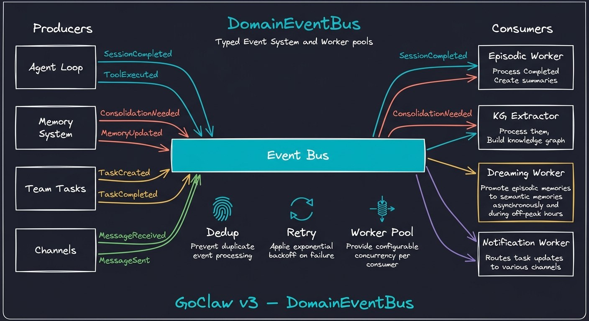

<p align="center">
  
</p>

<p align="center"><strong>Multi-Tenant AI Agent Platform</strong></p>

<p align="center">
Multi-agent AI gateway built in Go. 20+ LLM providers. 7 channels. Multi-tenant PostgreSQL.<br/>
Single binary. Production-tested. Agents that orchestrate for you.
</p>

<p align="center">
  <a href="https://docs.goclaw.sh">Documentation</a> •
  <a href="https://docs.goclaw.sh/#quick-start">Quick Start</a> •
  <a href="https://x.com/nlb_io">Twitter / X</a>
</p>

<p align="center">
  <a href="https://go.dev/"></a>
  <a href="https://www.postgresql.org/"></a>
  <a href="https://www.docker.com/"></a>
  <a href="https://developer.mozilla.org/en-US/docs/Web/API/WebSocket"></a>
  <a href="https://opentelemetry.io/"></a>
  <a href="https://www.anthropic.com/"></a>
  <a href="https://openai.com/"></a>
  
</p>

🌐 **Languages:**
[🇨🇳 简体中文](_readmes/README.zh-CN.md) ·
[🇯🇵 日本語](_readmes/README.ja.md) ·
[🇰🇷 한국어](_readmes/README.ko.md) ·
[🇻🇳 Tiếng Việt](_readmes/README.vi.md) ·
[🇵🇭 Tagalog](_readmes/README.tl.md) ·
[🇪🇸 Español](_readmes/README.es.md) ·
[🇧🇷 Português](_readmes/README.pt.md) ·
[🇮🇹 Italiano](_readmes/README.it.md) ·
[🇩🇪 Deutsch](_readmes/README.de.md) ·
[🇫🇷 Français](_readmes/README.fr.md) ·
[🇸🇦 العربية](_readmes/README.ar.md) ·
[🇮🇳 हिन्दी](_readmes/README.hi.md) ·
[🇷🇺 Русский](_readmes/README.ru.md) ·
[🇧🇩 বাংলা](_readmes/README.bn.md) ·
[🇮🇱 עברית](_readmes/README.he.md) ·
[🇵🇱 Polski](_readmes/README.pl.md) ·
[🇨🇿 Čeština](_readmes/README.cs.md) ·
[🇳🇱 Nederlands](_readmes/README.nl.md) ·
[🇹🇷 Türkçe](_readmes/README.tr.md) ·
[🇺🇦 Українська](_readmes/README.uk.md) ·
[🇮🇩 Bahasa Indonesia](_readmes/README.id.md) ·
[🇹🇭 ไทย](_readmes/README.th.md) ·
[🇵🇰 اردو](_readmes/README.ur.md) ·
[🇷🇴 Română](_readmes/README.ro.md) ·
[🇸🇪 Svenska](_readmes/README.sv.md) ·
[🇬🇷 Ελληνικά](_readmes/README.el.md) ·
[🇭🇺 Magyar](_readmes/README.hu.md) ·
[🇫🇮 Suomi](_readmes/README.fi.md) ·
[🇩🇰 Dansk](_readmes/README.da.md) ·
[🇳🇴 Norsk](_readmes/README.nb.md)

## Core Features

- **8-Stage Agent Pipeline** — context → history → prompt → think → act → observe → memory → summarize. Pluggable stages, always-on execution
- **4-Mode Prompt System** — Full / Task / Minimal / None with section gating, cache boundary optimization, and per-session mode resolution
- **3-Tier Memory** — Working (conversation) → Episodic (session summaries) → Semantic (knowledge graph). Progressive loading L0/L1/L2
- **Knowledge Vault** — Document registry with [[wikilinks]], hybrid search (FTS + pgvector), filesystem sync
- **Agent Teams & Orchestration** — Shared task boards, inter-agent delegation (sync/async), 3 orchestration modes (auto/explicit/manual)
- **Self-Evolution** — Metrics → suggestions → auto-adapt with guardrails. Agents refine their own communication style
- **Multi-Tenant PostgreSQL** — Per-user workspaces, per-user context files, encrypted API keys (AES-256-GCM), RBAC, isolated sessions
- **20+ LLM Providers** — Anthropic (native HTTP+SSE with prompt caching), OpenAI, OpenRouter, Groq, DeepSeek, Gemini, Mistral, xAI, MiniMax, DashScope, Claude CLI, Codex, ACP, and any OpenAI-compatible endpoint
- **7 Messaging Channels** — Telegram, Discord, Slack, Zalo OA, Zalo Personal, Feishu/Lark, WhatsApp
- **Production Security** — 5-layer permission system, rate limiting, prompt injection detection, SSRF protection, AES-256-GCM encryption
- **Single Binary** — ~25 MB static Go binary, no Node.js runtime, <1s startup, runs on a $5 VPS
- **Observability** — Built-in LLM call tracing with spans and prompt cache metrics, optional OpenTelemetry OTLP export

## Desktop Edition (GoClaw Lite)

A native desktop app for local AI agents — no Docker, no PostgreSQL, no infrastructure.

**macOS:**
```bash
curl -fsSL https://raw.githubusercontent.com/nextlevelbuilder/goclaw/main/scripts/install-lite.sh | bash
```

**Windows (PowerShell):**
```powershell
irm https://raw.githubusercontent.com/nextlevelbuilder/goclaw/main/scripts/install-lite.ps1 | iex
```

### What's Included
- Single native app (Wails v2 + React), ~30 MB
- SQLite database (zero setup)
- Chat with agents (streaming, tools, media, file attachments)
- Agent management (max 5), provider config, MCP servers, skills, cron
- Team tasks with Kanban board and real-time updates
- Auto-update from GitHub Releases

### Lite vs Standard

| Feature | Lite (Desktop) | Standard (Server) |
|---------|---------------|-------------------|
| Agents | Max 5 | Unlimited |
| Teams | Max 1 (5 members) | Unlimited |
| Database | SQLite (local) | PostgreSQL |
| Memory | FTS5 text search | pgvector semantic |
| Channels | — | Telegram, Discord, Slack, Zalo, Feishu, WhatsApp |
| Knowledge Graph | — | Full |
| RBAC / Multi-tenant | — | Full |
| Auto-update | GitHub Releases | Docker / binary |

### Building from Source
```bash
# Prerequisites: Go 1.26+, pnpm, Wails CLI (go install github.com/wailsapp/wails/v2/cmd/wails@latest)
make desktop-build                    # Build .app (macOS) or .exe (Windows)
make desktop-dmg VERSION=0.1.0        # Create .dmg installer (macOS only)
make desktop-dev                      # Dev mode with hot reload
```

### Desktop Releases
Desktop uses independent versioning with `lite-v*` tags:
```bash
git tag lite-v0.1.0 && git push origin lite-v0.1.0
# → GitHub Actions builds macOS (.dmg + .tar.gz) + Windows (.zip)
# → Creates GitHub Release with all assets
```

## Architecture

<p align="center">
  
</p>

<p align="center">
  
</p>

<p align="center">
  
</p>

<p align="center">
  
</p>

## Quick Start

**Prerequisites:** Go 1.26+, PostgreSQL 18 with pgvector, Docker (optional)

### From Source

```bash
git clone -b main https://github.com/nextlevelbuilder/goclaw.git && cd goclaw
make build
./goclaw onboard        # Interactive setup wizard
source .env.local && ./goclaw
```

> **Note:** The default branch is `dev` (active development). Use `-b main` to clone the stable release branch.

### With Docker

```bash
# Generate .env with auto-generated secrets
chmod +x prepare-env.sh && ./prepare-env.sh

# Add at least one GOCLAW_*_API_KEY to .env, then:
make up

# Web Dashboard at http://localhost:18790 (built-in)
# Health check: curl http://localhost:18790/health

# Optional: separate nginx for custom SSL/reverse proxy
# make up WITH_WEB_NGINX=1  → Dashboard at http://localhost:3000
```

`make up` creates a Docker network, embeds the correct version from git tags, builds and starts all services, and runs database migrations automatically.

**Common commands:**

```bash
make up                # Start all services (build + migrate)
make down              # Stop all services
make logs              # Tail logs (goclaw service)
make reset             # Wipe volumes and rebuild from scratch
```

**Optional services** — enable with `WITH_*` flags:

| Flag | Service | What it does |
|------|---------|-------------|
| `WITH_BROWSER=1` | Headless Chrome | Enables `browser` tool for web scraping, screenshots, automation |
| `WITH_OTEL=1` | Jaeger | OpenTelemetry tracing UI for debugging LLM calls and latency |
| `WITH_SANDBOX=1` | Docker sandbox | Isolated container for running untrusted code from agents |
| `WITH_TAILSCALE=1` | Tailscale | Expose gateway over Tailscale private network |
| `WITH_REDIS=1` | Redis | Redis-backed caching layer |

Flags can be combined and work with all commands:

```bash
# Start with browser automation and tracing
make up WITH_BROWSER=1 WITH_OTEL=1

# Stop everything including optional services
make down WITH_BROWSER=1 WITH_OTEL=1
```

When `GOCLAW_*_API_KEY` environment variables are set, the gateway auto-onboards without interactive prompts — detects provider, runs migrations, and seeds default data.

> **Docker image variants:**
> | Image | Description |
> |-------|-------------|
> | `latest` | Backend + embedded web UI + Python (**recommended**) |
> | `latest-base` | Backend API-only, no web UI, no runtimes |
> | `latest-full` | All runtimes + skill dependencies pre-installed |
> | `latest-otel` | Latest + OpenTelemetry tracing |
> | `goclaw-web` | Standalone nginx + React SPA (for custom reverse proxy) |
>
> For custom builds (Tailscale, Redis): `docker build --build-arg ENABLE_TSNET=true ...`
> See the [Deployment Guide](https://docs.goclaw.sh/#deploy-docker-compose) for details.

## Updating

### Docker
```bash
docker compose pull && docker compose up -d
```

### Binary (with embedded web UI)
```bash
goclaw update --apply    # Downloads, verifies SHA256, swaps binary, restarts
```

### Web Dashboard
Open **About** dialog → click **Update Now** (admin only). The update includes both backend and web dashboard when using the default `latest` image.

## Multi-Agent Orchestration

<p align="center">
  
</p>

Each agent runs with its own identity, tools, LLM provider, and context files. Three delegation modes — sync (wait), async (fire-and-forget), bidirectional — connected through explicit permission links with concurrency limits.

> Details: [Agent Teams docs](https://docs.goclaw.sh/#teams-what-are-teams)

## Knowledge Vault

<p align="center">
  
</p>

Document registry with `[[wikilinks]]` for bidirectional linking. Hybrid search combines full-text (BM25) and semantic (pgvector) for precise retrieval. Filesystem sync keeps vault in sync with on-disk files.

## Self-Evolution

<p align="center">
  
</p>

Agents improve themselves through a 3-stage guardrailed pipeline: metrics collection → suggestion analysis → auto-adaptation. Can refine communication style and domain expertise (CAPABILITIES.md) — but never change identity, name, or core purpose.

## Provider Adapters

<p align="center">
  
</p>

20+ LLM providers unified through a single adapter interface. Capability-based routing, encrypted API keys (AES-256-GCM), extended thinking support per-provider, and prompt caching for Anthropic + OpenAI.

## Event-Driven Architecture

<p align="center">
  
</p>

Typed domain events power the consolidation pipeline — session summaries, knowledge graph extraction, and dreaming promotion all run asynchronously via worker pools with dedup and retry.

## Built-in Tools

30+ tools across 8 categories:

| Category | Tools | Description |
|----------|-------|-------------|
| **Filesystem** | `read_file`, `write_file`, `edit_file`, `list_files`, `search`, `glob` | File operations with virtual FS routing |
| **Runtime** | `exec`, `browser` | Shell commands (approval workflow) + browser automation |
| **Web** | `web_search`, `web_fetch` | Search (Brave, DuckDuckGo) + content extraction |
| **Memory** | `memory_search`, `memory_get`, `knowledge_graph_search` | 3-tier memory + KG traversal |
| **Media** | `create_image`, `create_audio`, `create_video`, `read_*`, `tts` | Generation + analysis (multi-provider) |
| **Skills** | `skill_search`, `use_skill`, `skill_manage` | BM25 + semantic hybrid search |
| **Teams** | `team_tasks`, `spawn`, `delegate`, `message` | Task board + orchestration + messaging |
| **Automation** | `cron`, `heartbeat`, `sessions_*` | Scheduling + session management |

> Full tool reference at [docs.goclaw.sh](https://docs.goclaw.sh/#custom-tools)

## Documentation

Full documentation at **[docs.goclaw.sh](https://docs.goclaw.sh)** — or browse the source in [`goclaw-docs/`](https://github.com/nextlevelbuilder/goclaw-docs)

| Section | Topics |
|---------|--------|
| [Getting Started](https://docs.goclaw.sh/#what-is-goclaw) | Installation, Quick Start, Configuration, Web Dashboard Tour |
| [Core Concepts](https://docs.goclaw.sh/#how-goclaw-works) | Agent Loop, Sessions, Tools, Memory, Multi-Tenancy |
| [Agents](https://docs.goclaw.sh/#creating-agents) | Creating Agents, Context Files, Personality, Sharing & Access |
| [Providers](https://docs.goclaw.sh/#providers-overview) | Anthropic, OpenAI, OpenRouter, Gemini, DeepSeek, +15 more |
| [Channels](https://docs.goclaw.sh/#channels-overview) | Telegram, Discord, Slack, Feishu, Zalo, WhatsApp, WebSocket |
| [Agent Teams](https://docs.goclaw.sh/#teams-what-are-teams) | Teams, Task Board, Messaging, Delegation & Handoff |
| [Advanced](https://docs.goclaw.sh/#custom-tools) | Custom Tools, MCP, Skills, Cron, Sandbox, Hooks, RBAC |
| [Deployment](https://docs.goclaw.sh/#deploy-docker-compose) | Docker Compose, Database, Security, Observability, Tailscale |
| [Reference](https://docs.goclaw.sh/#cli-commands) | CLI Commands, REST API, WebSocket Protocol, Environment Variables |

## Testing

```bash
go test ./...                                    # Unit tests
go test -v ./tests/integration/ -timeout 120s    # Integration tests (requires running gateway)
```

## Project Status

See [CHANGELOG.md](CHANGELOG.md) for detailed feature status including what's been tested in production and what's still in progress.

## Acknowledgments

GoClaw was originally inspired by the [OpenClaw](https://github.com/openclaw/openclaw) project architecture.

## License

[CC BY-NC 4.0](LICENSE) — Creative Commons Attribution-NonCommercial 4.0 International

## Star History

<a href="https://www.star-history.com/?repos=nextlevelbuilder%2Fgoclaw&type=date&legend=top-left">
 <picture>
   <source media="(prefers-color-scheme: dark)" srcset="https://api.star-history.com/image?repos=nextlevelbuilder/goclaw&type=date&theme=dark&legend=top-left" />
   <source media="(prefers-color-scheme: light)" srcset="https://api.star-history.com/image?repos=nextlevelbuilder/goclaw&type=date&legend=top-left" />
   
 </picture>
</a>
